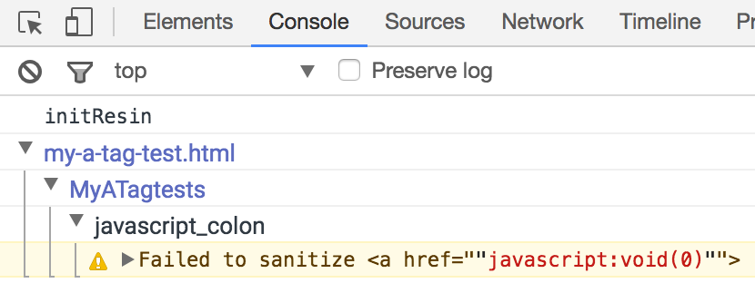
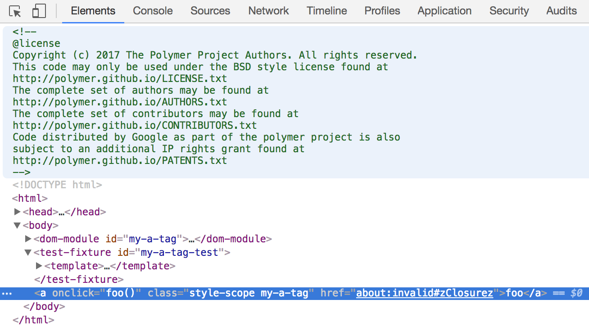

# Getting Started

*  [Loading polymer-resin into your app](#loading)
*  [Migrating an app or element to work with polymer-resin](#migrating)
*  [Debugging an app or element that uses polymer-resin](#debugging)
*  [End-to-end safety](#end-to-end)

This document explains how to use *polymer-resin*.  See [README.md] if
you want to know what *polymer-resin* is.


## <a name="loading">Loading polymer-resin into your app</a>

### Getting polymer-resin via bower

The easiest way to get *polymer-resin* is via [bower](https://bower.io/#getting-started) by installing the
[`polymer-resin`](http://bower.herokuapp.com/packages/polymer-resin) package.

```sh
$ bower info polymer-resin --verbose
...

Available versions:
  ...

You can request info for a specific version with 'bower info polymer-resin#<version>'
```

and to add a dependency on *polymer-resin* you can run

```sh
bower install --save polymer-resin
```

or if you want the specific version **1.2.3**

```sh
bower install --save polymer-resin#1.2.3
```


### Downloading a release

If you don't want to use bower, you can browse releases of
polymer-resin via the project's
[Github release page](https://github.com/Polymer/polymer-resin/releases)
and tarballs are available there.


### Integrating

Once you've got a release of polymer-resin you need to integrate it into your
app and ideally into your unit tests.

Within a release there are several versions of the code.

1.  If your Polymer project uses Google's **closure library** you can
    [vulcanize] your code with `polymer-resin/polymer-resin.html` which includes
    closure dependencies.
2.  If you do not use Google's closure library, then you can HTML import
    `polymer-resin/standalone/polymer-resin.html` which is **pre-compiled** with
    all the closure dependencies into one compact bundle.
3.  <a name="dash-debug"></a>The precompiled JS can be a bit hard to **debug** with.
    `polymer-resin/standalone/polymer-resin-debug.html` is less aggressively
    compiled and logs violations to the developer console.

We recommend using closure-library.  Polymer-resin treats
[`goog.html.SafeUrl`][safe-url] and other values as privileged so that
polymer apps can achieve [end-to-end XSS safety][safe-html-types] via
strict policies with type-checked exemptions from the rule.

Once you've found the variant you want, you can use a simple
[HTML import][html-import] to load it.

Polymer-resin must be loaded early to protect an application from reflected XSS, and
it should be loaded early in a test case so that the code being tested runs with
polymer-resin installed.

| Before | After |
| ------ | ----- |
| ```html
<html>
  <head>
    <script src="webcomponentsjs/webcomponents-lite.js"></script>


    <link rel="import" href="my-app.html" />
  <body>
    <my-app></my-app>
``` | ```html
<html>
  <head>
    <script src="webcomponentsjs/webcomponents-lite.js"></script>
    <link rel="import" href="polymer-resin/polymer-resin.html" />
    <script>// Configure polymer-resin.  Must not be empty.</script>
    <link rel="import" href="my-app.html" />
  <body>
    <my-app></my-app>
``` |

The *webcomponents-lite.js* script makes sure that the document supports
HTML importing, and must appear before polymer-resin is loaded.


### Configuring

The above polymer document shows a synchronous script tag.

```html
<script>// Configure polymer-resin.  Must not be empty.</script>
```

Due to a quirk of how HTML imports work, this must be present even if
you don't need to do any configuration.  This makes sure that the polymer-resin
JS will load before `<script src=...>`s loaded by subsequently imported modules.

Polymer-resin has a small API that allows granting privileges to application code.

[`security.polymer_resin.allowIdentifierWithPrefix('prefix-')`][allow-ident-prefix]
allows data bindings to specify `id="prefix-..."` attribute values.
Attacker controlled IDs are not an [arbitrary-code execution vulnerability][a.c.e.] but
skilled attackers have exploited the fact that `document.getElementById(x)` returns one
of potentially many elements with the same ID to exploit systems.  Ideally, an application
would make sure that important form input names and IDs controllable by attackers
are disjoint so that the content of inputs sent to the server reflects user intent.
If your application is not careful about IDs, and you want to use polymer-resin to
prevent arbitrary-code execution while you work on separating ID namespaces, you can
use the following:

```html
<script>security.polymer_resin.allowIdentifierWithPrefix('');</script>
```


## <a name="migrating">Migrating an app or element to work with polymer-resin</a>

TODO: explain how one can load a variant of polymer-resin compiled in
`UNSAFE_ADVISORY_ONLY` mode.  Polymer-resin doesn't actually
substitute innocuous values for unsafe inputs but logs and one can get
a digest from the console of rejected (element, attribute/property,
value) triples which allows running tests that don't include attempted
attacks and seeing the kinds of false positives that tend to show up.


## <a name="debugging">Debugging an app or element that uses polymer-resin</a>

Polymer-resin works by intercepting the values of data bindings before they
reach browser internals.  It applies a white-listing policy to values with
runtime type-checked exemptions.

Adding polymer-resin to a project helps protect against XSS but false
positives can happen.

For example, polymer-resin will find nothing wrong with:

```html
<a href="javascript:void(0)" onclick="foo()">foo</a>
```

A `javascript:` URL has been explicitly specified as the value of an
HTML attribute.  Polymer-resin never looks at regular attributes, only
data bound attributes.  A template author can specify anything they want.

But the following `href="..."` will be blocked:

```html
<dom-module id="my-a-tag">
  <template>
    <a href="[[_getUrl()]]" onclick="foo()">foo</a>
  </template>
  <script>
    Polymer({
      is: 'my-a-tag',
      _getUrl: function () { return "javascript:void(0)"; }
    });
  </script>
</dom-module>
```

In this case, the `javascript:` URL comes from a data binding.
Polymer evaluates the expressions inside `[[...]]` and `{{...}}` and
passes the results to polymer-resin to be checked.  Polymer-resin
assumes that any values are dangerous unless they match a strict
policy, **OR** have a runtime type that asserts they're safe in the
context of the given data binding expression.  `javascript:`,
`steam:`, `ms-its:`, and other protocols have been used to attack
users, so polymer-resin white-lists a small group of widely-used,
widely-tested, and well-understood protocols.

If you're using the [debug](#dash-debug) version of polymer-resin, you
should see the following in your JavaScript console.





In this case the string is safe and was specified by the author.
When polymer-resin is checking an `href="..."` attribute, it looks at
its [white-list][contracts-a-href] and realizes that the value will
be interpreted by the browser as a URL.  If the value is a
[`goog.html.SafeUrl`](safe-url) instance then it will be allowed, but
since the value is a regular string, it will not.

If this code cannot be refactored to use a `<button>` without a
data binding, then you could change the problematic `_getUrl` function
to do something like this:

```js
goog.require('goog.html.SafeUrl');
goog.require('goog.string.Const');

Polymer({
 is: 'my-a-tag',
 SAFE_URL: goog.html.SafeUrl.fromConstant(
     goog.string.Const.from('javascript:void(0)')),
 _getUrl: function () { return this.SAFE_URL; }
});
```

This requires the use of closure library code so does not work with
the `standalone/*` precompiled versions of polymer-resin.


## End-to-end safety

TODO: talk about using in conjunction with JSConformance and
`--polymer_pass` to check sanitariness of JS and sources of safe html
types.


[vulcanize]: http://closuretools.blogspot.com/2016/10/polymer-closure-compiler-in-gulp.html
[safe-url]: https://google.github.io/closure-library/api/goog.html.SafeHtml.html
[safe-html-types]: https://github.com/google/safe-html-types/blob/master/doc/safehtml-types.md
[html-import]: https://www.webcomponents.org/community/articles/introduction-to-html-imports
[allow-ident-prefix]: https://github.com/Polymer/polymer-resin/blob/6dbc44f9e5484771e483fdc0a3909f21eb1d99f9/polymer-resin.js#L51-L63
[a.c.e.]: https://en.wikipedia.org/wiki/Arbitrary_code_execution
[contracts-a-href]: https://github.com/Polymer/polymer-resin/blob/ff7f58f00ec0794517ecca11a801a2a7e6c04e84/lib/contracts/contracts.js#L296-L302
